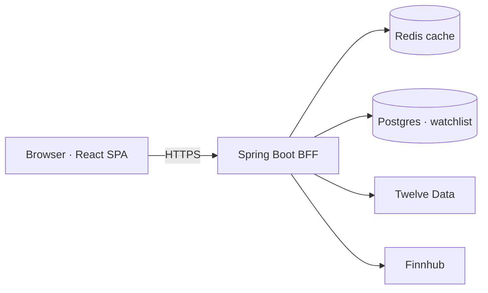

# Tickr · Global Equity & ETF Tracker

A polished, full-stack market tracker: search any US stock or ETF, view live quotes and an
interactive historical chart, scan a sector heatmap and top movers, read company news,
compare tickers, and keep a persisted watchlist.


> **Live demo:** _add your Vercel URL here after deploying (Phase 8)._
>
> _Screenshots live in `docs/screenshots/` — add a hero shot once deployed._

---

## Features

- **Markets home** — a live index strip (S&P 500, Nasdaq, Dow, Russell 2000, plus
  international ETFs), an interactive **sector heatmap**, and **top gainers/losers**.
- **Search anything** — a ⌘K command palette with symbol + company-name autocomplete.
- **Stock detail** — current quote, a **Robinhood-style gradient area chart** with
  1D/1W/1M/3M/1Y/5Y ranges, key statistics, and a company **news feed**.
- **Compare** — overlay 2–4 tickers on one chart, normalized to percent change.
- **Watchlist** — add/remove symbols, persisted server-side (no login) and enriched with
  live quotes.
- **Built for real life** — loading skeletons, error boundaries, graceful empty states, a
  "backend is waking up" banner for free-tier cold starts, full mobile layout, dark theme.

## Tech stack

| Layer | Choices |
|---|---|
| Frontend | React 19, TypeScript, Vite, Tailwind CSS v4, Recharts, TanStack Query, React Router |
| Backend | Spring Boot 3 (Java 21), Spring Web, Spring Cache, Spring Data JPA, Resilience4j, springdoc/OpenAPI |
| Data | [Twelve Data](https://twelvedata.com/) (search, charts) · [Finnhub](https://finnhub.io/) (quotes, news, fundamentals) |
| Storage | Redis (response cache) · Postgres (watchlist) |
| Hosting | Vercel (web) · Render (API) · Upstash (Redis) · Neon (Postgres) |
| Quality | JUnit 5 · WireMock · Vitest · Testing Library · GitHub Actions |

## Architecture



The Spring Boot app is a **Backend-for-Frontend**: it owns the upstream API keys (never
exposed to the browser), caches responses in Redis, and persists the watchlist in Postgres.
The React app only ever talks to our backend.

## Design notes (free-tier engineering)

The interesting constraint is that the free upstream tiers are tight, so providers are
split by their strengths:

- **Finnhub (60 req/min)** powers all the high-volume **live quotes** — index strip,
  heatmap, movers, watchlist.
- **Twelve Data (800 req/day)** powers **search, charts and compare** — low-volume,
  on-demand, long-cached.
- **Redis caching** with per-endpoint TTLs (quotes 60s, history 6h, news 15m, search 1h)
  collapses bursts of requests into very few upstream calls.
- **Resilience4j** adds a light retry + timeout so a transient upstream blip doesn't fail a
  request, and every failure maps to a typed JSON error the UI can reason about.

## Quick start (local — no Docker required)

The `local` Spring profile uses in-memory H2 + an in-memory cache, so the backend needs no
external services. Grab two free API keys: [twelvedata.com](https://twelvedata.com/) and
[finnhub.io](https://finnhub.io/).

```bash
# Terminal 1 — backend (http://localhost:8080, Swagger at /swagger-ui.html)
cd backend
TWELVE_DATA_API_KEY=your_key FINNHUB_API_KEY=your_key ./mvnw spring-boot:run

# Terminal 2 — frontend (http://localhost:5173, proxies /api -> :8080)
cd frontend
npm install
npm run dev
```

Optional: `docker compose up -d` brings up local Redis + Postgres if you'd rather run the
`prod` profile against them (see `docker-compose.yml`).

## Testing

```bash
cd backend && ./mvnw test     # JUnit 5, WireMock (upstream), H2 (JPA), MockMvc
cd frontend && npm run test   # Vitest + Testing Library
```

CI (`.github/workflows/ci.yml`) runs both on every push and pull request.

## Project structure

```
tickr/
  backend/    Spring Boot API (provider adapters, services, web, JPA)
  frontend/   React SPA (pages, components, api hooks)
  docker-compose.yml   Optional local Redis + Postgres
  .github/workflows/ci.yml
```

## Deployment

Frontend → Vercel (root `frontend/`, env `VITE_API_BASE_URL`).
Backend → Render (Docker, from `backend/Dockerfile`), with env: `TWELVE_DATA_API_KEY`,
`FINNHUB_API_KEY`, `REDIS_URL` (Upstash), `DATABASE_URL` (Neon), `CORS_ORIGINS`,
`SPRING_PROFILES_ACTIVE=prod`.

---

_For demonstration only. Market data is delayed and provided as-is; this is not investment advice._
